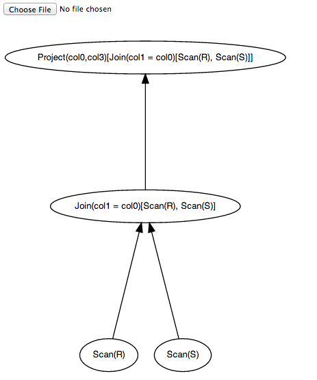

Plan visualization for the Datalog Compiler
===========================================

The utility in this directory, `generateGv`, has a few queries hardcoded.

    # A simple join
    query = "A(x,z) :- R(x,y), S(y,z)"
    
    # Triangle
    # query = "A(x,z) :- R(x,y),S(y,z),T(z,x)"

When run, it uses `Operator.collectGraph` in `../raco/algebra.py` to
recursively collect the graph from the logical plan. Then it uses `print_gv` to print out a very simple GraphViz program.

When you run

    ./generateGv.py

you should see

    digraph G {
      ratio = 1.333333 ;
      mincross = 2.0 ;
      rankdir = "BT" ;
      nodesep = 0.25 ;
      node [fontname="Helvetica", fontsize=10, shape=oval, style=filled, fillcolor=white ] ;
    
      "4406471568" [label="Project(col0,col3)[Join(col1 = col0)[Scan(R), Scan(S)]]"] ;
      "4406471352" [label="Join(col1 = col0)[Scan(R), Scan(S)]"] ;
      "4406470272" [label="Scan(R)"] ;
      "4406470992" [label="Scan(S)"] ;
    
      "4406471352" -> "4406471568" ;
      "4406470272" -> "4406471352" ;
      "4406470992" -> "4406471352" ;
    }

If you store this in a file, e.g., `./generateGv.py > tmp.gv`, then you can
visualize the query plan by selecting that `.gv` file in the little Javascript
webapp when you open the `vizplan.html` file in an HTML5-compliant browser.

### Note

Note the crazy `PYTHONPATH` hacking in the first line of the file that enabled me to put it in a subdirectory when `raco` is not in the full system `PYTHONPATH`.